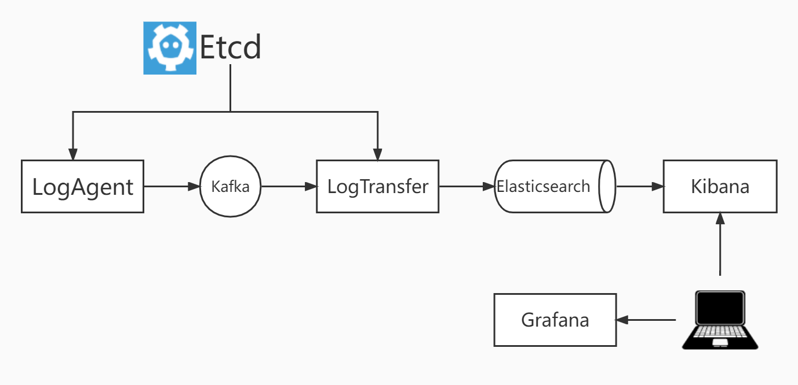

# Go_Logcollection 日志收集服务


## 软件架构



---
说明

logAgent从etcd中获取要收集的日志信息从业务服务器读取日志信息，发往kafka。

logTransfer负责从kafka读取日志，写入到Elasticsearch中，通过Kibana进行日志检索。

最后通过Grafana进行服务器状态可视化展示。

---

快速开发环境

使用docker-compose快速部署开发环境

```yaml
version: '3'
services:
  zookeeper:
    image: wurstmeister/zookeeper
    ports:
      - "2181:2181"
  kafka:
    image: wurstmeister/kafka
    ports:
      - "9092:9092"
    environment:
      # client 要访问的 broker 地址
      KAFKA_ADVERTISED_HOST_NAME: 192.168.228.128
      # 通过端口连接 zookeeper
      KAFKA_ZOOKEEPER_CONNECT: zookeeper:2181
      # 每个容器就是一个 broker，设置其对应的 ID
      KAFKA_BROKER_ID: 0
      # 外部网络只能获取到容器名称，在内外网络隔离情况下
      # 通过名称是无法成功访问 kafka 的
      # 因此需要通过绑定这个监听器能够让外部获取到的是 IP 
      KAFKA_ADVERTISED_LISTENERS: PLAINTEXT://192.168.228.128:9092
      # kafka 监听器，告诉外部连接者要通过什么协议访问指定主机名和端口开放的 Kafka 服务。
      KAFKA_LISTENERS: PLAINTEXT://0.0.0.0:9092
      # Kafka默认使用-Xmx1G -Xms1G的JVM内存配置，由于服务器小，调整下启动配置
      # 这个看自己的现状做调整，如果资源充足，可以不用配置这个
      # 设置 kafka 日志位置
      KAFKA_LOG_DIRS: "/kafka/logs"
      # kafka 自动创建 topic，对于生成者与消费者连接的 TOPIC 不存在自动创建
      KAFKA_AUTO_CREATE_TOPICS_ENABLE: 'true'
      # kafka 开启删除 topic，开了自动创建，删除的也要开，否则删除后还会自动创建
      KAFKA_DELETE_TOPIC_ENABLE: 'true'
    volumes:
      - /var/run/docker.sock:/var/run/docker.sock
  etcd:
    container_name: etcd
    image: bitnami/etcd:3
    restart: always
    environment:
      - ALLOW_NONE_AUTHENTICATION=yes
    ports: 
    - "2379:2379"

```


```yaml
version: '3'                          
services:
  elasticsearch:                                           #服务的名称
    image: elasticsearch:7.12.0         #指定镜像的路径
    restart: always                                        #启动docker，自动运行当前容器
    container_name: elasticsearch                          #容器名称
    ports:                                                 #指定多个端口
      - 9200:9200                                          #映射的端口号
    environment:
      discovery.type: single-node
  kibana:
    image:  kibana:7.12.0
    environment:
      SERVER_NAME: kibana
      ELASTICSEARCH_URL: http://192.168.228.128:9200
    ports:
      - "5601:5601"
    depends_on:
      -  elasticsearch


```

